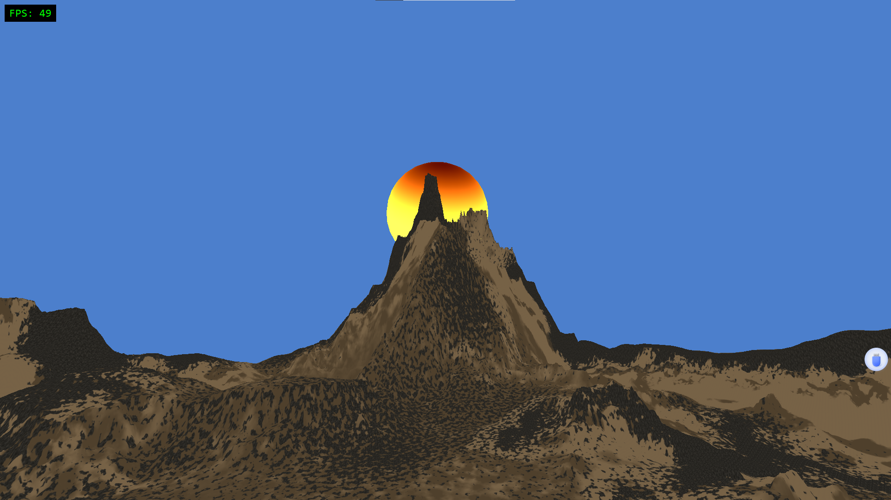

# HT_Engine

> **"We don't train models. We define worlds."**

A high-performance Python game engine focused on realistic natural environment simulation.



*HT_Engine Demo - 49 FPS, orange-yellow sun, dry rock sand terrain (~520K triangles)*

**Model Source:** The terrain model shown in this screenshot is "Dry Rock Sand Terrain" by **josevega**.
- **Author:** josevega
- **Source:** https://www.aigei.com/item/free_dry_rock.html
- **License:** See model license on Aigei.com

The sun effect is procedurally generated using shaders.

**Note:** This demo (`terrain_demo.py`) is specifically customized for this terrain model. If you use other models (e.g., from the MODELS_GUIDE.md), you may need to adjust the code (such as normal flipping, scaling, or material settings) to display them correctly.

**Note on Visuals:** The sun in this demo is procedurally generated using a simplified shader-based approach, created entirely from code without external assets. While AAA games typically use complex sky systems with volumetric lighting, atmospheric scattering simulations, and HDR cubemaps for realistic sun effects, this implementation demonstrates the engine's core rendering capabilities with a lightweight, code-only solution. The focus is on performance and functionality rather than photorealism at this stage.

**Performance Benchmark:**
- **GPU:** NVIDIA GTX 1650 Max-Q (4GB VRAM)
- **FPS:** 49 FPS stable
- **Model:** ~520,000 triangles (Dry Rock Sand Terrain by josevega)
- **Demo:** `terrain_demo.py`
- **Active GPU-Accelerated Features:**
  - GPU Occlusion Culling (Lighting.OcclusionGPU)
  - Screen Space Shadows (Lighting.ScreenSpaceShadows)
  - Enhanced Atmospheric Scattering (Atmosphere.ScatteringEnhanced)
  - Atmospheric Optical Effects (Atmosphere.OpticalGPU)
  - Global Illumination Probes (Lighting.GlobalIlluminationProbes)
  - Volumetric Light / God Rays (VolumetricLight)
  - Advanced Lighting System
  - Simple Physics (Physics.SimpleRigidBody)

*Yes, this is a pure Python engine achieving 49 FPS on a mid-range laptop GPU with 520K triangles and full texture mapping while running 8+ GPU-accelerated rendering features. Even we were surprised.*

**Even More Impressive:** We have tested HT_Engine with a **720,000 triangle model** (Iceland Mountain from Aigei.com) and achieved **49 FPS** with the same GPU-accelerated features. Due to copyright restrictions, we cannot include this model in the open-source repository or showcase it directly. However, you can download it yourself and test the engine's capabilities: [Aigei.com - Iceland Mountain](https://www.aigei.com/item/bing_chuan_xue_11.html).

## Current Status: 0.8 MVP

> **🚨 Urgent Notice from the Author:**
> *"My mom is about to take away my computer, so I'm open-sourcing this now. Enjoy!"*
> 
> — Wang Ruilin, 16, probably grounded soon

**What is this?**

HT_Engine is **0.8 MVP** (Minimum Viable Product). It's functional and you can build with it, but there's still work to do.

**Why 0.8 and not 1.0?**

- The engine is functional but not yet production-ready
- Some features are experimental or incomplete
- Performance optimizations are ongoing
- API may change in future updates

We openly acknowledge our limitations and the "legacy code" (some parts of the codebase need refactoring). The engine was developed with AI assistance for coding, which helped accelerate development but also means some code patterns may not be optimal.

**Our Commitment:**
- We will continue to update, optimize, and improve the engine
- Regular updates will be released as we fix bugs and add features
- Community feedback is welcome and appreciated
- We aim to make this a truly capable engine for indie developers

## Features

- 🌲 **Natural System**: Symbolic AI-based environment simulation
- 🎨 **Advanced Rendering**: OpenGL 4.5 + GPU acceleration
- 🏔️ **Terrain System**: Large-scale terrain rendering support
- 💡 **Lighting System**: Real-time shadows, volumetric light, atmospheric scattering
- 🎮 **Simple API**: Easy-to-use game development interface

## System Requirements

- Python 3.10+
- OpenGL 4.5 compatible graphics card
- Recommended: NVIDIA GTX 1650 or higher

## Quick Start

```bash
# Install dependencies
pip install -r requirements.txt

# Run the demo
python play_test_iceland.py
```

## License

This project uses a **dual-license model**: GPLv3 + Commercial License

### Option 1: GPLv3 (Free)

- ✅ Personal learning and research: Completely free
- ✅ Engine improvements: Must be open-sourced
- ✅ Commercial use: Allowed, but must open-source entire work
- ❌ Cannot modify in closed source

### Option 2: Commercial License (Paid)

- ✅ Can modify in closed source
- ✅ Can develop commercial products in closed source
- ✅ No need to disclose source code
- 💰 Annual fee model (current) + Annual fee + revenue share model (future)

**⚠️ Mandatory Attribution Requirement:**
All games developed using HT_Engine must display in the startup screen:
- Text: "Made with HT_Engine" or "Powered by HT_Engine"
- Duration: At least 2 seconds
- Location: Splash screen, loading screen, or main menu

**Current Stage (Author is a Minor):**

| Developer Type | Annual Fee | Notes |
|---------------|------------|-------|
| Impoverished Developer/Student | Year 1: $0, Year 2: $5, Year 3+: $10 | Poverty proof required (low-income certificate, debt, no income, etc.) |
| Regular Student | $20/year | Student ID required |
| Individual Developer | $50/year | Independent developer, non-company entity |
| Small Team (≤5 people) | $200/year | Core development team only, excluding marketing/admin |
| Medium Team (6-20 people) | $1000/year | Core development team only, excluding marketing/admin |
| Large Enterprise (>20 people) | $3000/year | Core development team only, excluding marketing/admin |

**Future Stage (After Author Becomes Adult and Establishes Company):**

Base annual fee + revenue share (when annual revenue exceeds threshold):

| Developer Type | Revenue Threshold | Revenue Share Rate |
|----------------|-------------------|-------------------|
| Impoverished Developer | ≥$100k/year | Year 1: 0%, Year 2: 0.1%, Year 3+: 1% |
| Individual Developer | $50k-$100k: 0.5%<br>≥$100k: 1% | Tiered calculation |
| All Teams | $100k-$500k: 1%<br>≥$500k: 2% | Unified standard |

**Technical Support:**
The author is a 16-year-old student. All technical support is provided on a best-effort basis with no guaranteed response time. Paid users do not receive exclusive technical support services.

See [COMMERCIAL_LICENSE](COMMERCIAL_LICENSE.md) for details.

### Comparison

| Feature | GPLv3 | Commercial License (Current) | Commercial License (Future) |
|---------|-------|------------------------------|----------------------------|
| Cost | Free | Free (attribution required) | Free (attribution required) |
| Open source requirement | Must open source | No need | No need |
| Closed source development | ❌ Not allowed | ✅ Allowed (attribution required) | ✅ Allowed (attribution required) |
| Technical support | Best-effort (no guarantee) | Best-effort (no guarantee) | Best-effort (no guarantee) |
| Suitable for | Open source projects, learning | Commercial games, closed source products | Commercial games, closed source products |

| Use Case | GPLv3 | Commercial (Current) | Commercial (Future) |
|---------|-------|---------------------|---------------------|
| Personal learning | ✅ Free | ✅ Free (attribution required) | ✅ Free (attribution required) |
| Open source games | ✅ Free | ✅ Free (attribution required) | ✅ Free (attribution required) |
| Closed source games (impoverished/student) | ❌ Not allowed | ✅ $0-$10/year (attribution required) | ✅ 0%-1% share (attribution required) |
| Closed source games (individual) | ❌ Not allowed | ✅ $50/year (attribution required) | ✅ 0.5%-1% share (attribution required) |
| Closed source games (small team) | ❌ Not allowed | ✅ $200/year (attribution required) | ✅ 1%-2% share (attribution required) |
| Closed source games (medium team) | ❌ Not allowed | ✅ $1000/year (attribution required) | ✅ 1%-2% share (attribution required) |
| Closed source games (large enterprise) | ❌ Not allowed | ✅ $3000/year (attribution required) | ✅ 1%-2% share (attribution required) |

**All commercial license use cases require mandatory attribution.**

For detailed terms, see [LICENSE](LICENSE) and [COMMERCIAL_LICENSE](COMMERCIAL_LICENSE.md).

## Contributing & Academic Recognition

### How to Contribute

Issues and Pull Requests are welcome!

### Contributor Benefits

**Immediate Benefits:**
- Contributors retain attribution rights to their code
- Grant the author the right to use the code in commercial versions
- Eligible for commercial license discounts (contact author)

**Academic Recognition:**

For contributors who provide significant technical contributions:

| Contribution Level | Recognition |
|-------------------|-------------|
| **Core Algorithm Development** | Co-author (2nd or 3rd author) on HT_Engine research papers |
| **Major Technical Breakthrough** | Co-author on papers related to their contribution |
| **Significant Feature Implementation** | Acknowledged in paper contributions section |
| **Bug Fixes & Documentation** | Listed in project contributors and acknowledgments |

**Criteria for Co-authorship:**
- Direct participation in core algorithm design and implementation
- Providing critical technical insights that significantly improve the engine
- Major breakthrough contributions to rendering, physics, or AI systems
- Sustained contribution over an extended period

**Criteria for Acknowledgments:**
- Code contributions (features, optimizations, bug fixes)
- Documentation improvements
- Community support and mentoring
- Testing and quality assurance
- Technical discussions and suggestions

### Publication Plan

The author is currently exploring the academic potential of HT_Engine's innovative technologies. Should the project itself—or substantial algorithmic contributions from collaborators—yield significant theoretical breakthroughs, particularly in areas such as symbolic AI for environmental simulation, GPU acceleration strategies, or novel rendering techniques, there may be opportunities for collaborative academic publications. Those who provide key algorithmic insights or core technical contributions will naturally be considered for appropriate authorship or recognition in any resulting scholarly work. However, the primary focus remains on building a robust, practical engine for the game development community.

## Contact

- Email: 13910593150@139.com
- WeChat: wxid_pt34d1oc0a0d22

## Acknowledgments

Every contribution to HT_Engine, whether large or small, is deeply appreciated. This project exists because of the collective effort of passionate individuals who believe in democratizing game development technology.

### Core Contributors

*To be updated as the project grows*

### Special Thanks

- All GitHub contributors who submitted code, documentation, or bug reports
- Community members who provided feedback and suggestions
- Early adopters who tested the engine and reported issues
- Technical experts who shared their knowledge and insights
- Everyone who believed in this project and helped it grow

### Technical Advisors

*To be updated as the project grows*

---

**Note**: This acknowledgment list will be continuously updated. If you have contributed to HT_Engine and are not listed here, please contact the author to be added.

---

**Note**: This project is still under active development. APIs may change.

---

## About the Author


**Wang Ruilin (王瑞霖)** - Creator of HT_Engine

I'm Wang Ruilin, nicknamed **"Hutou" (Tiger Head)**, a 16-year-old high school student from China. I built this game engine in my spare time between classes. I'm passionate about symbolic AI, rendering, and GPU acceleration. I want games that don't just look good—they should feel alive. I also believe in **technology democratization**: stunning visuals shouldn't require expensive hardware. If Unreal Engine can create breathtaking scenes, why can't we achieve something similar on a budget laptop? That's the challenge I'm taking on. Why Python instead of C++? Two answers—high EQ: we're exploring the performance ceiling of interpreted languages. Low EQ: I don't know C++.

---

> **"We don't train models. We define worlds."**
>
> *- Wang Ruilin, Creator of HT_Engine*
